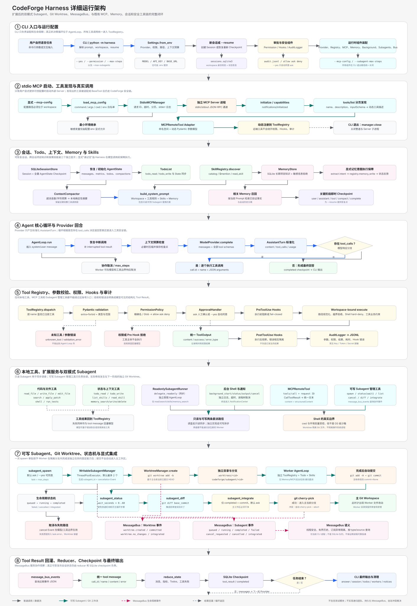
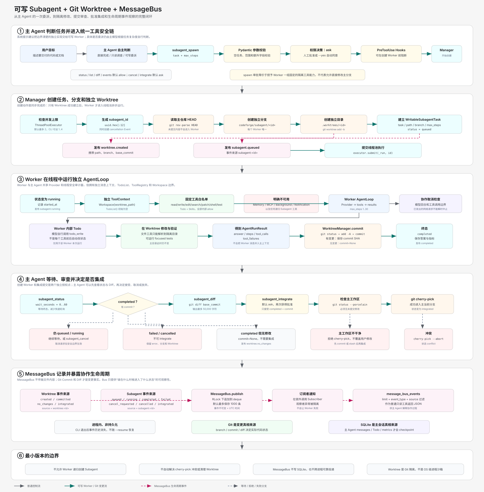
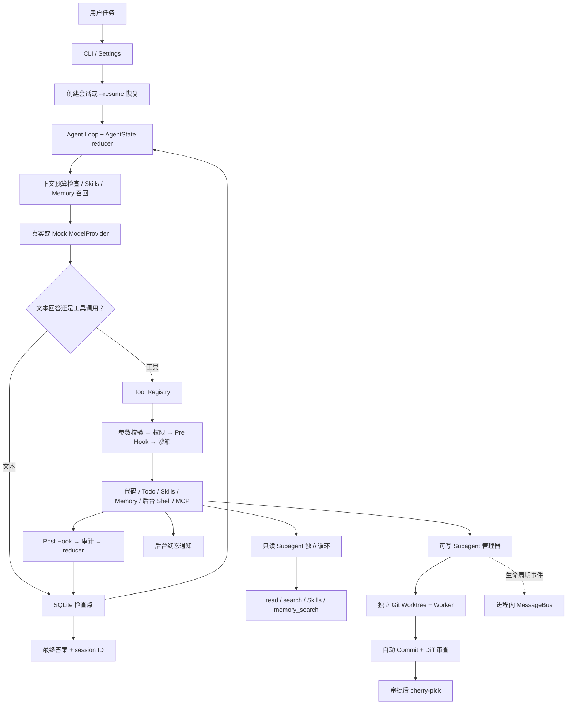

# CodeForge Harness 架构

CodeForge 使用原生循环连接模型、工具和本地工作区，并已加入长期 Memory、
同步只读 Subagent、异步可写 Subagent、后台 Shell、stdio MCP、Git Worktree 和
进程内 MessageBus。

完整模块图：

可写协作子系统的单独展开图：

## Day 3～Day 4 数据位置

- 短期运行状态：`AgentState`，包含消息、指标、Todo 和压缩次数。
- 会话与检查点：workspace 内的 `.codeforge/sessions.sqlite3`。
- 审计日志：workspace 内的 `.codeforge/audit.jsonl`。
- 用户级 workspace Skills：`.codeforge/skills/<name>/SKILL.md`。
- 项目共享 Skills：`skills/<name>/SKILL.md`。
- 长期项目记忆：`.codeforge/memory.sqlite3`。
- 后台命令日志：`.codeforge/background/<job_id>.log`。

SQLite 检查点保存的是完整可恢复状态；上下文压缩改变后续发送给模型的消息，压缩
结果也会立即创建检查点。审计日志负责回答“工具做过什么”，会话数据库负责回答
“Agent 对话和计划进行到哪里”，Memory 负责“哪些已确认知识值得跨会话复用”。

通知和 MessageBus 当前只在一个 CLI 进程内保存；后台进程在退出时清理。只读
Subagent 同步执行且没有写工具；可写 Subagent 异步运行在独立 Worktree，完成后
自动提交，但必须经过 Diff 审查和 `subagent_integrate` 才会进入主分支。当前不做
递归团队、事件持久化、自动冲突解决和操作系统级进程隔离。
